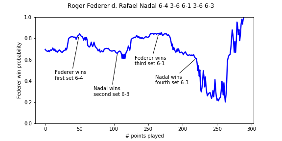

# tennis_match_prediction

Accurate in-match prediction for tennis is important to a variety of communities, including sports journalists, tennis aficionados, and professional sports betters. In-match prediction consists of the following estimate:  given any score between two players and all historical information about the two players, what is the probability that each player wins the match? While win-probability graphs have recently received more attention in football (see Brian Burke's http://www.advancedfootballanalytics.com) and baseball, they still receive little exposure in tennis, because strong tools for their prediction have not been implemented and been made widely available (until now!).

This project explores new approaches and also implements known methods, evaluating models on tens of thousands of ATP/WTA matches from the twenty-first century. No prior published papers have compared the effectiveness of in-match prediction models at this scale before. Because an effective pre-match forecast forms the starting point for an in-match model, I explore match prediction in two steps: pre-match prediction and in-match prediction.  The technical implementation details are further described in 'requirements.txt'.  Instructions on running the code and interpreting the results can be found in 'get_started.txt'.

All tennis match and point-by-point datasets are supplied by Jeff Sackmann, and you can access them at https://github.com/JeffSackmann/. Together, this code produces relevant player information (eg player's elo, serve/return percentages over the past twelve months heading into a match) for any tour-level match from 1968-present. Then, approaches and results are documented in 'pre_match_predictions.ipynb' and 'in_match_predictions.ipynb'.

Please provide attribution for any use of this code.

You can reach me at jacobgollub@college.harvard.edu